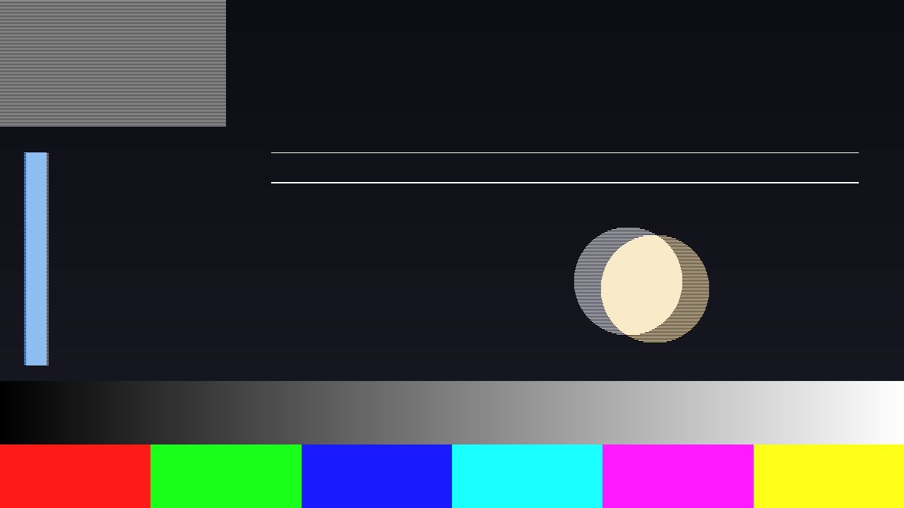
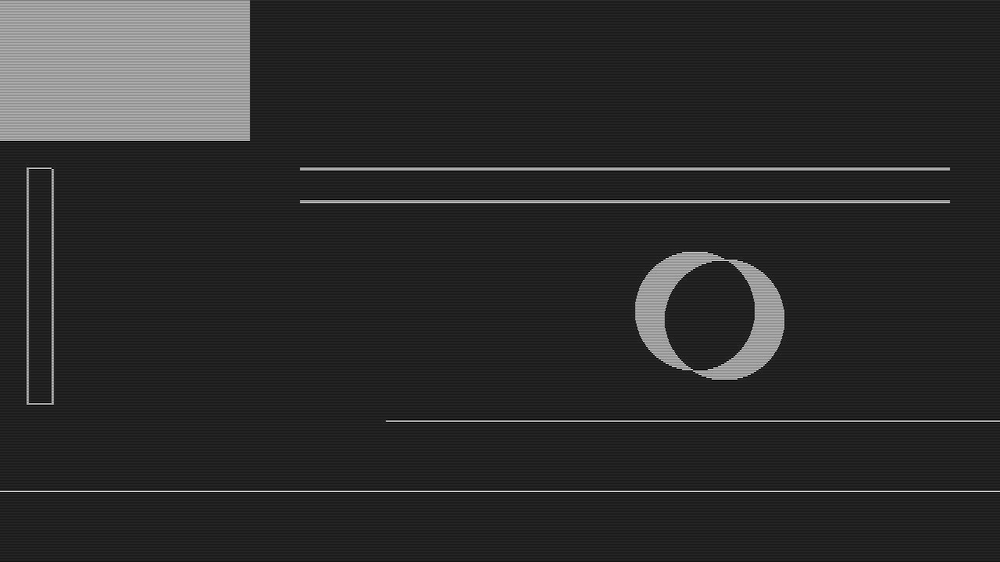

# Cadence

> **AI-assisted project.** This codebase was created with [Claude](https://claude.com/claude-code)
> (Anthropic), directed and reviewed by a human author. The field arithmetic is
> verified numerically by an offline harness that drives the real plugin class in
> a headless GL context: a bar moving v pixels a frame is proved to comb by
> **exactly v on every row** (1,980 rows per speed, largest error 0 px), the
> motion-adaptive mode is proved to collapse to Bob Linear and to Weave at its
> two extremes **byte for byte** (0 of 2,995,200 bytes differ), and the 2:3
> pattern is read back out of the picture rather than asserted against a second
> copy of the rule — see [Status](#status). It has **never been loaded into
> Resolume**: it has only been compiled, rendered and measured offline. Nothing
> has been built for Windows. Check it in your own rig before trusting it in a
> show.

Interlace, pulldown, and every way a deinterlacer gets it wrong — as an FFGL
effect for [Resolume](https://resolume.com) Arena and Avenue.



*Weave on a 30i stream built from the harness's own moving test card. The disc
and the bar are each in two places at once — their two fields are 1/60 s apart,
and a weave shows both. The grating top-left is twittering. Rendered by `cdtest`,
not captured from Resolume.*

## The one idea

**A field is a slice of time, not just a slice of lines.**

A television picture is two fields 1/50 or 1/60 s apart, each carrying alternate
lines. Cadence treats the clip that way — one rule, `field k carries the source
frame current at the middle of its own field period` — then puts a film cadence
in front of it and shows the result on a progressive screen through a
deinterlacer you choose.

Everything you recognise falls out of that. None of it is drawn:

| What you see | Why it happens |
| --- | --- |
| **Combing** | A moving object's two fields are `v · T_field` apart, so a weave puts it in two places at once. |
| **Bob bounce** | Line doubling has to invent the missing rows, and the invention lands one row lower on one field than the other — so static fine detail jumps a line each field. |
| **Ghosting** | Averaging two fields of a moving object is two objects at half strength. |
| **Adaptive mistakes** | The per-pixel weave/bob decision, at a threshold too high (combing leaks) or too low (detail goes soft). |
| **3:2 judder** | 24 frames laid into 60 fields cannot be even, so motion moves in a 2-3-2-3 rhythm. |
| **A mis-lock** | An edit landing mid-cycle, which a naive inverse telecine keeps weaving the wrong pair through until it re-locks. |
| **The stutter** | Believing the wrong field came first: two steps forward, one back. |

There is no table of cadences anywhere in the source. 2:3, 2:2 and one-field-per-frame
are the same equation at different rates.



*`Adaptive` with **Show Decision** on: white is where the two fields disagree
enough that the pixel bobs, black is where they agree and it weaves. Everything
that moved is white; everything that did not is black. Move **Adaptive
Threshold** and watch the line between them — too high and combing leaks into the
black, too low and still detail goes soft in the white.*

## Controls

**Source** — how the clip becomes fields.
*Field Source* (`Split`: one input frame per field, alternating parity — honest,
and the default; `Telecine`: the input taken as *Source Rate* and laid into
*Field Rate*; `Cadence Break`: the same with an edit every *Break Interval*, or
on an audio onset), *Source Rate* (24/25/30/60), *Field Rate* (50/60), *Field
Order*, *Swap Field Order*, *Break Interval*, *Break On Onset*, *Audio*.

**Deinterlace** — *Mode* (`Weave`, `Bob`, `Bob Linear`, `Blend`, `Adaptive`,
`Inverse Telecine`), *Adaptive Threshold*, *Lock Time*, *Show Decision*.

**Display** — *Display* (`Progressive`, or `Fields` for one field on its own
lines with the rest black, which is what a CRT shows in one field period),
*Line Filter*.

**Output** — *Mix*.

Two worth knowing:

- **Swap Field Order does nothing under Weave**, and that is correct rather than
  a bug — a weave uses both fields and does not care which came first. It shows
  up the moment a mode displays one field at a time.
- **Lock Time** decides whether the inverse telecine re-locks after an edit *at
  all*. Short, and it chases every break; long, and it never converges and sits
  on whatever it locked onto first.

## Status

**v0.1.0, and honestly early.** It has never been loaded into Resolume and has
never been installed into Extra Effects — everything below is the offline
harness, which drives the real plugin class headlessly. Measured on an M4 Max,
macOS 26.4.1, on 2026-09-21. Run it yourself with `tools/verify.sh`, which builds
the universal bundle from scratch and takes about twelve seconds.

| Check | Result |
| --- | --- |
| Weave combs by exactly `v` | 1,980 rows per speed at v = 1, 3, 7 — **largest error 0 px** |
| Bob bounces one line | a two-line rule's top edge alternates rows 80/81; a one-line rule exists on alternate fields only |
| 2:3 pulldown | runs of `3 2 3 2 …` read back out of the picture; input frames advance 2.47 host frames per source frame against 2.50 wanted. 30→60 and 25→50 give pairs |
| Adaptive collapses | threshold 0 **is** Bob Linear and 1 **is** Weave — **0 of 2,995,200 bytes differ**; 0.15 is neither |
| Swapped field order | shown-field sequence `1 0 3 2 5 4 …` against `0 1 2 3 4 5 …` |
| Inverse telecine | clean 2:3 settles and combs **0** frames once settled; after cadence breaks, **4** re-locks at Lock Time 0.05 s against **0** at 4 s |
| A resize mid-run | ring rebuilt empty, **0** stale pixels, no crash — also across both Field Source changes |
| No dead controls | all **14** swept parameters measurably change the picture |
| macOS binary | universal (`x86_64 arm64`), exports `plugMain`, plist correct, ad-hoc signs |
| What a host sees | `oxbow probe`: name `SW Cadence`, id `CD01`, type `effect` |
| Render cost | **0.53 ms/frame at 1080p**, 2.14 ms at 4K (0.86 and 3.18 in Inverse Telecine, which adds a readback per field) |

**Not done:** never loaded into Resolume; nothing built or run for Windows, and
the CI and release workflows have never run because this repo has no remote; no
OpenFX port and no browser demo (neither is required at 0.1.0); no user guide, so
the About block has three buttons rather than four; no factory presets; the audio
path has only ever seen a synthetic click train, never real music.
`source/StoatworksAbout.h` and `ATTRIBUTIONS.md` are provisional hand copies in
the shape the fleet's sync scripts generate. See [AGENTS.md](AGENTS.md) for the
full list of what is assumed rather than measured, and for the traps.

## Build

```bash
git clone --recursive https://github.com/stoatworks-labs/cadence
cd cadence
cmake -B build -DCMAKE_BUILD_TYPE=Release
cmake --build build
cmake --install build     # straight into Resolume's Extra Effects folder, on macOS
```

macOS builds universal (arm64 + x86_64) by default; add
`-DCMAKE_OSX_ARCHITECTURES=arm64` for a faster development build. Needs CMake
3.15+, a C++17 compiler and the FFGL SDK submodule (pinned to `b1afaf9`).

A bundle you build yourself is unsigned, which is fine locally — quarantine only
applies to files that arrive from a browser.

## Building and testing

The harness renders the real plugin class offline and asserts one claim per flag:

```bash
./build/cdtest --out /tmp/frame.png     # the moving test card, through the plugin
./build/cdtest --list                   # every parameter, its kind and default
./build/cdtest --comb                   # a moving bar combs by exactly v
./build/cdtest --bob                    # a two-line detail bounces one line
./build/cdtest --pattern                # 2:3 emits A A B B B C C D D D
./build/cdtest --adaptive               # 0 is Bob Linear, 1 is Weave, pixel-exact
./build/cdtest --swap                   # the two-forward-one-back stutter
./build/cdtest --lock                   # the inverse telecine locks, mis-locks, re-locks
./build/cdtest --ring                   # a resize mid-run clears the ring
./build/cdtest --bench                  # 720p through 4K
python3 tools/sweep.py                  # no control is silently dead
tools/verify.sh                         # all of it, from a fresh universal build
```

`--set "Name=value"` sets any control by its display name, repeatably, and
`--tone` pushes a synthetic click train into the audio input.

<!-- attributions:start -->
This project is built on other people's work — see [ATTRIBUTIONS.md](ATTRIBUTIONS.md).
<!-- attributions:end -->

## Licence

MIT — see [LICENSE](LICENSE).

The processes modelled here — 2:3 pulldown, weave, bob, field blending,
motion-adaptive deinterlacing and inverse telecine — are decades old and
described in the broadcast engineering literature. No code was taken from any
deinterlacer implementation.
